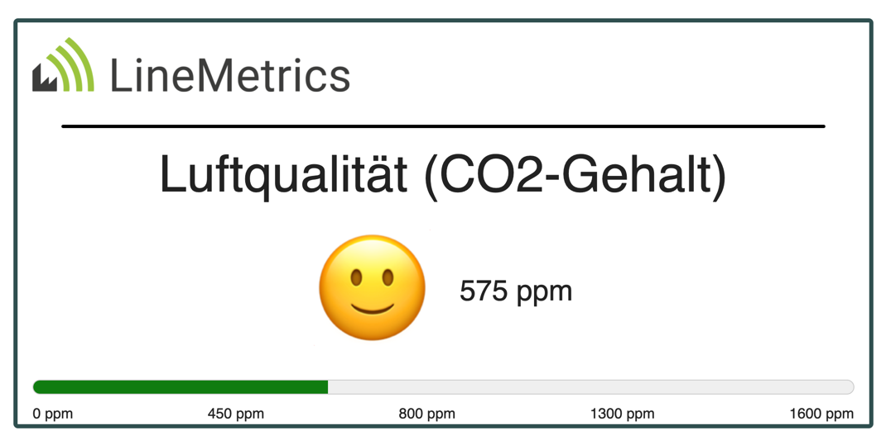
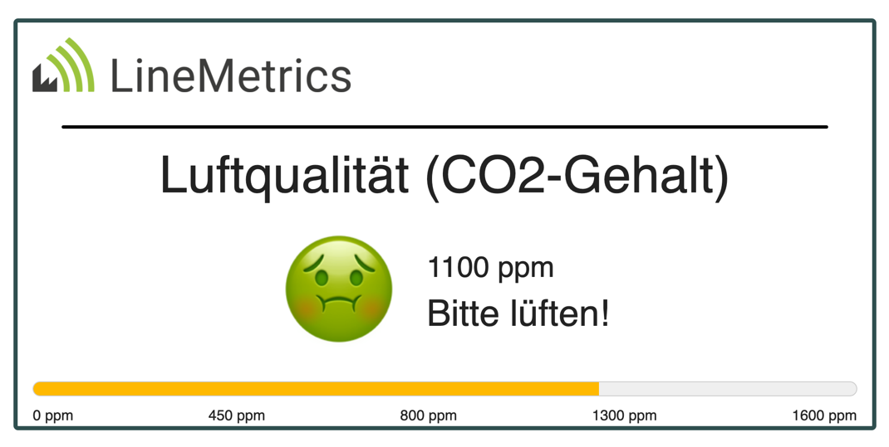

# lm-dashboard-html5

These are just templates. You can copy them and use them as you want.

## Template: Basic co2 Dashboard
### Screenshots

Text in Screenshots is in german.

Value in good range:


Value in bad range: 


### Configuration
```
{{baseUrl}}/?ai={clientId}&as={clientSecret}&mpa={measurement_point_alias}&oi={object_id}
```

- BaseUrl: Where the static side is hosted
- ai (clientId): Client Id of the API Credentials (Contact LineMetrics)
- as (clientSecret): Client Secret of the API Credentials (Contact LineMetrics)
- mpa (measurement_point_alias): The Alias of the CO2 measurement point who should be displayed.
- oi (object_id): The Object Id where the measurement point is assigned to.

Example with hosted Dashboard on Github Pages:
```
https://linemetrics.github.io/lm-dashboard-html5?ai={clientId}&as={clientSecret}&mpa={measurement_point_alias}&oi={object_id}
```
