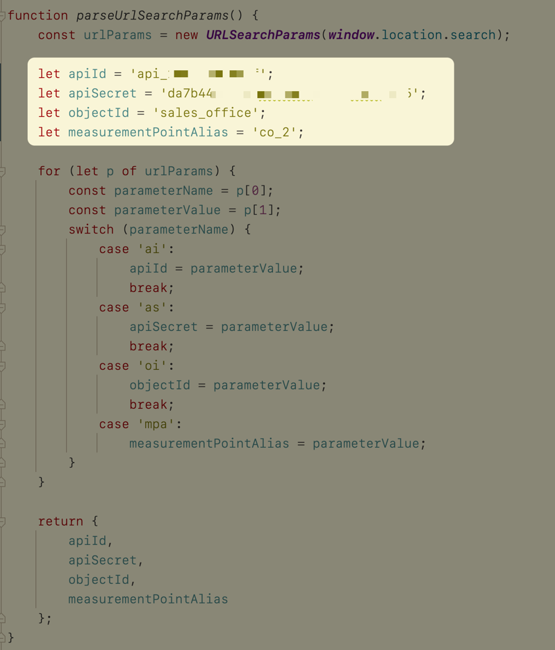

# lm-dashboard-html5

These are just templates. You can copy them and use them as you want.

## Template: Basic co2 dashboard
### Prerequisites to use the dashboard
- Modern Browser with HTML5
- Enabled Javascript
- Internet connection

### Screenshots

Text in screenshots is in german.

Value in good range:


Value in bad range: 


### Configuration
#### Via URL
```
{{baseUrl}}/?ai={clientId}&as={clientSecret}&mpa={measurement_point_alias}&oi={object_id}
```

- BaseUrl: Where the static side is hosted
- ai (clientId): Client id of the API credentials (contact LineMetrics)
- as (clientSecret): Client secret of the API credentials (contact LineMetrics)
- mpa (measurement_point_alias): The alias of the CO2 measurement point who should be displayed.
- oi (object_id): The object id where the measurement point is assigned to.

Example with hosted dashboard on Github Pages:
```
https://linemetrics.github.io/lm-dashboard-html5?ai={clientId}&as={clientSecret}&mpa={measurement_point_alias}&oi={object_id}
```

#### Fix in Code
Second possibility is to provide no URL parameter and instead set the variables in the main.js file 
in the function _parseUrlSearchParams()_.

