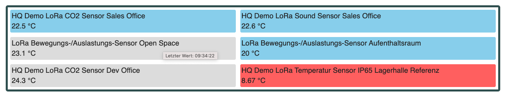
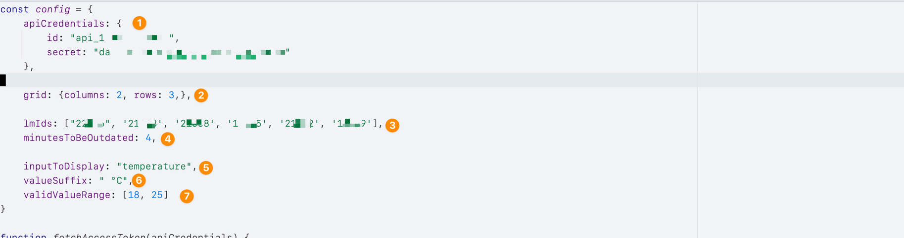

# Last Value Dashboard

## Einleitung

Mit diesem Template kann man die Letztwerte von Sensoren übersichtlich in einer Tabelle darstellen. Folgende Funktionen
sind zusätzlich verfügbar:

* Es ist möglich einen zu Bereich definieren, sodass die Kachel Rot angezeigt wird, sobald der Letztwert des Sensors
  diesen über- oder unterschreitet.
* Es ist möglich einen Zeitbereich zu definieren und wenn dieser überschritten ist, wird die Kachel Grau angezeigt.
* Das Dashboard lädt sich automatisch alle 10 Minuten neu.

## Beispiel

Nachfolgender Screenshot zeigt ein Dashboard von sechs Sensoren aus dem LineMetrics HQ Account. Der gültige Wertebereich
in diesem Beispiel ist 18 bis 25. Der gültige Zeitbereich sind 4 Minuten. Ein neuer Wert muss also in den letzten vier
Minuten aufgezeichnet worden sein. Man sieht, dass drei Sensoren im gültigen Bereich (blaue Kacheln) sind, zwei Werte
veraltet sind (graue Kachlen) und ein Wert außerhalb des Bereichs ist (rote Kachel).

## Konfiguration

Das Dashboard lässt sich durch eine die JavaScript Variable "config" in der Datei "main.js" konfigurieren.

1. Api Credentials: Hierbei handelt es sich um Zugangsdaten zur RestAPI von LineMetrics. Diese können direkt bei
   LineMetrics beantragt werden.
2. Tabellendefinition: Legt fest, wieviele Spalten und Zeilen die Tabelle haben soll.
3. lmIds der Sensoren: Jeder Sensor von LineMetrics hat eine LmId. In diesem Feld werden die einzelnen LmIds, die im
   Dashboard angezeigt werden sollen, angegeben.
4. Ein Sensorwert darf nicht älter als x Minuten sein. Ansonsten wird er als veraltet angezeigt.
5. inputToDisplay: Welcher Messwert eines Sensor angezeigt werden soll. In diesem Fall Temperatur. Das Dashboard eignet
   sich auch für CO2, etc.
6. Ein Text, der nach dem Wert angezeigt werden soll, beispielsweise die Einheit. In diesem Fall " °C"
7. Der Bereich, in dem ein Wert sein muss, sodass er nicht rot angezeigt wird.

## Einrichtung

* Downloaden Sie den gesamten Ordner "last_value_dashboard"
* konfigurieren sie die "main.js"-Datei (wie in Konfiguration beschrieben)
* öffnen Sie "index.html" in einem Browser
